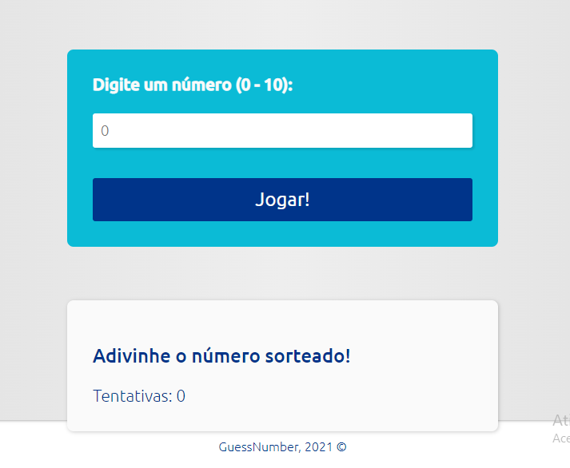

#   Projeto: GuessNumber

## Descrição:
Projeto, brincando com os números, tentativas de acertar o número correto de (0-10). 
Pondo em prática meus conhecimentos em HTML, CSS e JavaScript!

[🔗 Clique aqui para acessar](https://marcos-franco.github.io/GuessNumber/)

## 🛠 Tecnologias:
- HTML
- CSS
- Javascript
- Git
- Github

## Status do Projeto:
100% Concluído

## Autor:
Projeto desenvolvido por [Marcos Franco](https://www.linkedin.com/in/marcosfranco-5b1a8a111/)

## 💛 Contatos:

Linkedin: https://www.linkedin.com/in/marcosfranco-5b1a8a111/

Repositório Github: https://github.com/marcos-franco

WhatSapp: https://contate.me/marcos-franco

E-mail: masf68@hotmail.com
